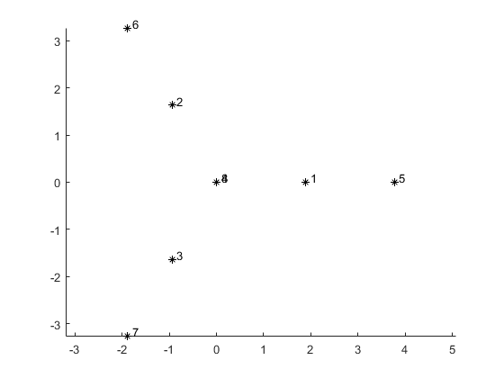
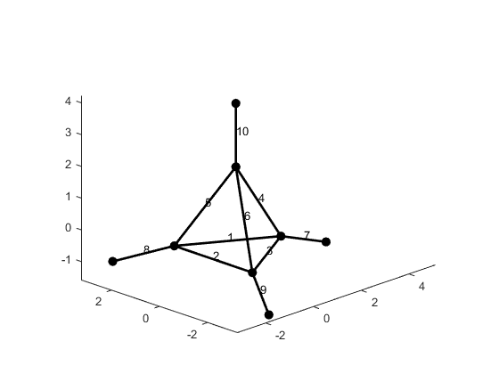
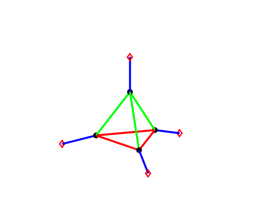
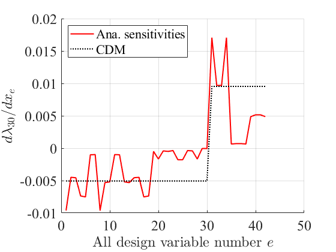

# Symmetry and Differentiability of Multiple Evals: 3D Truss
## Authors: Shiyao Sun (ssun4@nd.edu) and Kapil Khandelwal (kapil.khandelwal@nd.edu)
## 1. Published Matlab Script
**Link:** [Published script for this project](https://htmlpreview.github.io/?https://github.com/cpssldomain/Symmerty-and-Multiple-Evalues-3D-trusses/blob/main/html/main.html) <br /><br />
**Preview:** 


## 2. Functionalities
### 2.a Truss Geometry
**Example:**


### 2.b Set Design Variable Symmetry
**Example:**


### 2.c Eigen-analysis
**Example:**


### 2.d Eigenvalue Sensitivity Check
**Example:**


## 3. Key Functions
### 3.a Plot Truss Nodes
- **Link:** [plot_pts3d(coord)](/plot_pts3d.m) <br />
- **Parameter:**
  - *coord*: matrix; (nnodes,3)  double *nnodes: number of nodes 
    - nodal coordinates of 3D truss  
- **Example:** <br />


### 3.b Plot Truss Structure
- **Link:** [plot_3d_truss(nele, coord, conn, fixity)](/plot_3d_truss.m) <br /><br />
- **Parameters:** 
  - *nele*: integer
    - number of elements
  - *coord*: matrix; (nnodes,3) double *nnodes: number of nodes 
    - nodal coordinates of 3D truss
  - *conn*: matrix; (nele,2) double *nele: number of elements
    - connectivity of elements
  - *fixity*: matrix; (3,nnodes) double *nnodes: number of nodes
    - boundary condition of nodes
- **Example:** <br />


### 3.c Plot Truss Design Variables
- **Link:** [plot_3d_truss_color(fixity, nele, coord, conn, ng, group, eid_flag)](/plot_3d_truss_color.m) <br /><br />
- **Parameters:**
  - *fixity*: matrix; (3,nnodes) double *nnodes: number of nodes
    - boundary conditions of nodes
  - *nele*: integer
    - number of elements
  - *coord*: matrix; (nnodes,3) double *nnodes: number of nodes 
    - nodal coordinates of 3D truss
  - *conn*: matrix; (nele,2) double *nele: number of elements
    - connectivity of elements
  - *ng*: integer
    - number of groups/(symmetric) design variables
  - *group*: structure array; (1,ng) struct
    - contains the element number array of each design variable group
  - *eid_flag*: integer
    - element ID flag (0: no show element ID; 1: show element ID) 
- **Example:** <br />



### 3.d Eigen-analysis
- **Link:** [emodes, evals = truss_eigenanalyses_3d(nele, nnodes, fixity, conn, coord, A, E, rho, type)](/truss_eigenanalyses_3d.m) <br /><br />
- **Parameters:**
  - *nele*: integer
    - number of elements
  - *nnodes*: integer
    - number of nodes
  - *fixity*: matrix; (3,nnodes) double *nnodes: number of nodes
    - boundary conditions of nodes
  - *conn*: matrix; (nele,2) double *nele: number of elements
    - connectivity of elements
  - *coord*: matrix; (nnodes,3) double *nnodes: number of nodes
    - nodal coordinates of 3D truss
  - *A*: matrix; ones(nele,1) double
    - unit element design variables
  - *E*: matrix; (nele,1) double
    - Young's modulus of elements
  - *rho*: matrix; (nele,1) double
    - mass density of elements
  - *type*: integer
    - eigen-analysis type (1: regular eigen-analysis; 2: generalized eigen-analysis (eigenfrequency, used in this work))
- **Returns:**
  - *emodes*: matrix; (nf, nf) *nf: number of free degrees of freedom
    - eigenmodes
  - *evals*: matrix; (nf, 1) *nf: number of free degrees of freedom
    - eigenvalues 

### 3.e Eigenvalue Sensitivity
- **Link:** [dKff_dA, dMff_dA = truss_derivatives_3d(nele, nnodes, fixity, conn, coord, E, rho, eleid)](/truss_derivatives_3d.m) <br /><br />
- **Parameters:**
  - *nele*: integer
    - number of elements
  - *nnodes*: integer
    - number of nodes
  - *fixity*: matrix; (3,nnodes) double *nnodes: number of nodes
    - boundary conditions of nodes
  - *conn*: matrix; (nele,2) double *nele: number of elements
    - connectivity of elements
  - *coord*: matrix; (nnodes,3) double *nnodes: number of nodes
    - nodal coordinates of 3D truss
  - *E*: matrix; (nele,1) double
    - Young's modulus of elements
  - *rho*: matrix; (nele,1) double
    - mass density of elements
  - *eleid*: integer
    - element ID
- **Returns:**
  - *dKff_dA*: matrix; (nf, nf) *nf: number of free degrees of freedom
    - derivative of Kff (stiffness matrix considering free degrees of freedom) w.r.t one design variable
  - *dMff_dA*: matrix; (nf, nf) *nf: number of free degrees of freedom
    - derivative of Mff (mass matrix considering free degrees of freedom) w.r.t one design variable
   
### 3.f Plot Eigenvalue Sensitivity
- **Link:** [plot_eigval_sensitivity(e_ord, ele_vec, dfdx_cdm_uncluster, dfdx_uncluster)](/plot_eigval_sensitivity.m) <br /><br />
- **Parameters:**
  - *e_ord*: integer
    - order of the eigenvalue of interest
  - *ele_vec*: matrix; (1,ng) double *ng: number of (symmetric) design variables
    - 1:ng
  - *dfdx_cdm_uncluster*: matrix; (ng, 1) double *ng: number of (symmetric) design variables
    - individual eigenvalue sensitivity w.r.t (symmetric) design variables using central difference method (CDM)
  - *dfdx_uncluster*: matrix; (ng, 1) double *ng: number of (symmetric) design variables
    - analytical individual eigenvalue sensitivity w.r.t (symmetric) design variables
- **Example:** <br />


## How to cite 
If you've used this work in your research or find it useful in any way, please consider to cite:
```
@misc{SS_KK_EV2024,
  author = {Sun, Shyiyao and Khandelwal, Kapil},
  title = {Structural Symmetry, Multiplicity, and Differentiability of Eigenfrequencies},
  year = {2024},
  publisher = {GitHub},
  journal = {GitHub repository},
  howpublished = {\url{https://github.com/cpssldomain/Symmerty-and-Multiple-Evalues-3D-trusses}},
  }
```
